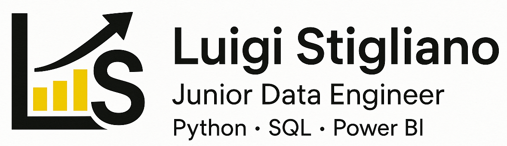

**Ciao a tutti 👋**

Mi chiamo Luigi Stigliano e sono un _Junior Data Engineer_ con sede in Italia 🇮🇹.  
Sono appassionato di dati, automazione e soluzioni scalabili.  
Attualmente sto approfondendo le mie competenze in Python, SQL e Power BI.

🎯 Obiettivi attuali:
- _Sviluppare competenze avanzate nel campo dell'ingegneria dei dati_ 📊
- _Contribuire a progetti open-source focalizzati sull'analisi e la visualizzazione dei dati_ 🛠️

Queste sono le mie statistiche GitHub (clicca per visualizzarle) 📈

_
Dai un'occhiata ai miei progetti! 👇
_
