  

  <!---->

  # 💫 **About Me**
  
  ### 👋 *Ciao a tutti!*
  
  Mi chiamo **Luigi Stigliano** e sono un *Junior Data Engineer* con sede in Italia 🇮🇹.  
  Sono appassionato di **dati**, **automazione** e **soluzioni scalabili**.
  
  Ho un particolare interesse per la *ricerca operativa* e l'*ottimizzazione dei processi*.  
  Attualmente sto approfondendo le mie competenze in **Python**, **SQL** e **Power BI**.
  
  ### 🎯 **Obiettivi attuali**:
  
  📊 Sviluppare **competenze avanzate** nel campo dell'*ingegneria dei dati*  
  🛠️ Contribuire a **progetti open-source** focalizzati sull'*analisi e la visualizzazione dei dati*

  
  # 💻 **Tech Stack**
  
   
   
   
   
   
  
  
   
   
   
   
  
  
  
  
  

   
   
   

  
  # 📊 **GitHub Stats**
  
  
  
  
  
  

  
  # 🐍 **GitHub Contributions Snake**
  
  <picture>
    <source media="(prefers-color-scheme: dark)" srcset="https://raw.githubusercontent.com/LuigiStigliano/LuigiStigliano/output/github-snake-dark.svg" />
    <source media="(prefers-color-scheme: light)" srcset="https://raw.githubusercontent.com/LuigiStigliano/LuigiStigliano/output/github-snake.svg" />
    
  </picture>

  
  ## 🌐 **Socials**
  
   
   
  
  
  ### 👇 *Dai un'occhiata ai miei progetti!*

